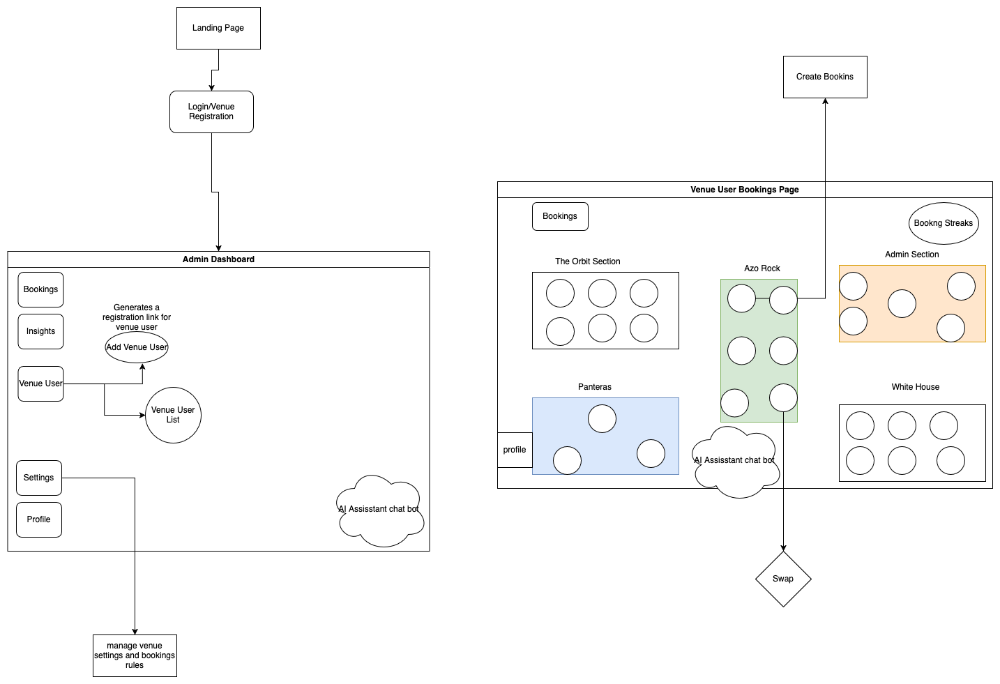

# ORBIT CO-WORKSPACE
Orbit co-workspace is platform as a service, where venue owner or business owner can use the platform for their co-workingspace business

## About
Orbit Co-workingspace platform allows co-workspace owners to have clients book space seamlessly leveraging orbit provided features for seamless and concurrent bookings.




## Requirements
### Function Requirements
- Authentication: Owners Registers and creates their venue platform, sends a registration invite to other user with the preferred user `tag/type`, 
- User Privileges and Permissions: User has different tags/types with different permissions tied to them
    - Admin User can manage the workspace settings, invite other users
    - Other user tag like Learner can book for a spot but are restricted to manage workspace settings
    - Admin Users and other Privileged tag users  get access to mini dashboard where dey can manage the workspace and track insights reports
- Booking System: User can book seamlessly without overlapping bookings, client server gets real-time update once a new booking is made
- Users and Admin are notified through emails for bookings, and bookings updates
- User Notification reminder for checkin when their checking time is near
- Workspsace Report and Analytics: Admin users can view realtime analytics charts and stats
- User Roles/Tags
- Seat Swap System
- AI Powered Workspace Assistant
- Booking Streak


### Non Functional Requirements
- High Availability
- Low Latency
- Scalability


### Tools
- Typescript
- Nestjs
- Nextjs
- Bull for task queue
- Redis for cache and task queue broker
- Realtime Events and Updates - Firebase Real-Database
- Docker/Docker compose
- Amazon Q for completions and Coding Assistant


## Getting started with developing

### Install dependencies for the backend
```sh
npm run install:server
```

### Install dependencies for the frontend

```sh
npm run install:client
```

or 

### Install both dependencies all at once
```
npm run install:all
```

### Install @nestjs/config package
```sh
npm install @nestjs/config
```

### Start both the frontend and backend server concurrently

```sh
npm run dev
```


### TODO for 12-04-2025
- Setup TypeORM with Postgres
- Set up API Design - Response format, Error handling
- Setup our entities schema
- implement User Auth
- Implement Venue/org management endpoint
- Implement Spaces/Section List endpoint
- Implement add now admin user registration
- Venue settings application
- tags Crud
